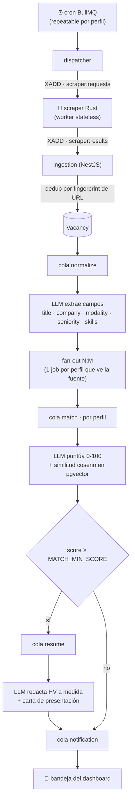
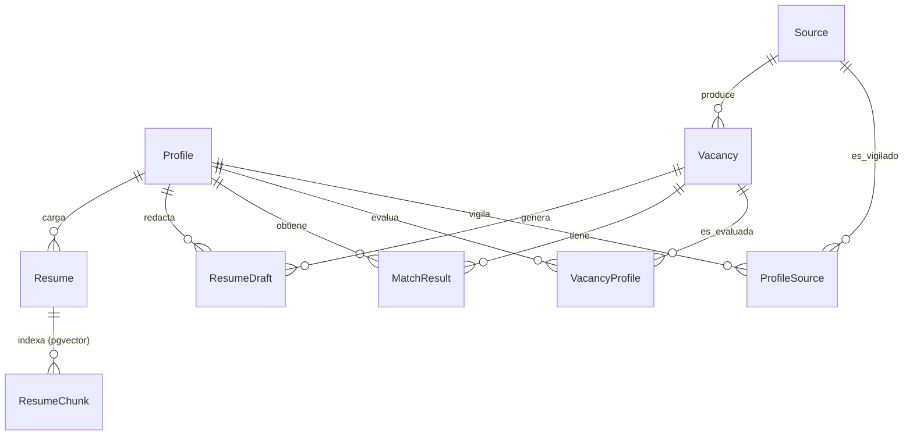

# CV Harness

> Harness **event-driven** que detecta vacantes en bolsas de empleo configurables, las **evalúa contra tu perfil con IA** (match híbrido IA + semántico), les mide el **encaje ATS**, y genera una **hoja de vida personalizada + carta de presentación** en PDF — todo gestionable desde un dashboard web.

<p>
  
  
  
  
  
  
</p>

---

## El problema que resuelve

Buscar trabajo en tecnología a mano es repetitivo y caro en tiempo: hay que entrar portal por portal, leer decenas de ofertas, decidir cuáles encajan de verdad, y **reescribir la hoja de vida para cada postulación** (además de pasar los filtros automáticos de los ATS).

CV Harness automatiza ese ciclo completo:

- **Recolecta** vacantes de fuentes propias (cada URL con su receta de selectores y su cadencia).
- **Entiende** cada oferta con IA (título, empresa, ubicación, **modalidad**, seniority, requisitos, skills).
- **Puntúa el encaje** contra tu perfil combinando análisis de IA + similitud semántica contra tu HV real (pgvector).
- **Redacta** una HV a medida y una carta de presentación, fieles a tu CV original.
- **Mide el ATS** con un score reproducible, no a ojo.
- **Notifica** todo en un dashboard donde se revisa, edita y descarga.

Todo corre como un pipeline de eventos: nada bloquea, cada etapa es una cola, y un fallo de IA no tumba el flujo.

---

## Arquitectura



**Transporte:** BullMQ (colas + jobs repeatable) dentro de Nest, y **Redis Streams** con consumer groups para el puente Nest ⇄ Rust. Nada síncrono entre servicios.

| Etapa | Responsabilidad | Tecnología |
|---|---|---|
| **dispatch** | Decide qué fuentes vencen y pide el scrape | BullMQ repeatable |
| **scraper** | Baja el listado y cada aviso aplicando una receta de selectores CSS | Rust + `scraper` + `reqwest` |
| **ingestion** | Valida el resultado y **deduplica por `sha256(url)`** | Nest + zod |
| **normalize** | Limpia el texto y extrae campos estructurados con IA | LLM (adaptador) |
| **match** | Puntúa encaje 0-100 y arma la estrategia de aplicación | LLM + pgvector |
| **resume** | Redacta la HV personalizada y la carta | LLM + plantilla PDF |
| **notification** | Deja el resultado en la bandeja del dashboard | Postgres + polling |

---

## Features

### 🔎 Búsqueda y evaluación
- **Fuentes configurables sin tocar código**: se pega una URL y el sistema **verifica el sitio antes de scrapear** y propone la receta de selectores de forma asistida (plantilla conocida → heurística sobre el HTML real → IA como afinador), con **previsualización** de lo detectado para confirmar.
- **Motores de plantilla** (Computrabajo CO, fixture E2E) + fallback heurístico + fallback IA.
- **Recetas genéricas**: sumar portales nuevos es pegar URL + selectores desde la UI, no programar un integrador.
- **Fuentes por API oficial** (`Source.kind = API_JSON`): cuando el portal publica API/RSS, el harness la consulta directo —con la **API key en variable de entorno**, nunca en la base— y mapea su JSON al mismo pipeline (dedup + normalización + match). Esa vía **ni siquiera pasa por el worker Rust**. Plantilla lista: **Jooble** (`POST https://jooble.org/api/{key}`, key gratis), verificada contra la API real.
- **Reintentos con backoff** en las fuentes de API (`retryAttempts`/`retryDelayMs`): medido que los WAF alternan `200`, `403` y `500` para el **mismo** request, así que sin reintentos una corrida falla al azar. Un `404`/`400` no se reintenta (no se arregla insistiendo).
- **Fetch realista en Rust**: cabeceras completas de Chrome (client hints, `Sec-Fetch-*`, `Accept-Language`), **cookie jar** (la sesión que se abre en el listado vale para las páginas de detalle), compresión gzip/brotli y HTTP/2. Las cabeceras extra por fuente se configuran en la receta (`headers`).
- **Diagnóstico honesto del bloqueo**: el probe lee `Cf-Mitigated`, `Server` y `cf-ray` y distingue un **challenge de Cloudflare** ("no se resuelve con headers ni User-Agent: usá la API oficial o una sesión de navegador") de un 403 común o un 429. El mensaje genérico de antes mandaba a cambiar el User-Agent, que en ese caso no sirve.
- **Cron por perfil**: cada perfil corre *sus* fuentes con su propia cadencia (selector en horas) o un "Buscar ahora" manual.
- **Polite scraping**: `respectRobots`, delays y límites por fuente.

### 🧠 Match inteligente
- **Extracción estructurada con IA** (requisitos, deseables, skills, seniority, modalidad).
- **Match híbrido**: `final = 0.65 · análisis IA + 0.35 · similitud semántica` contra la HV activa del perfil.
- **Similitud semántica real** con **pgvector** (embeddings de OpenAI `text-embedding-3-small`) + resumen de fortalezas, brechas, ángulo y canal sugerido.
- **Modelo N:M**: una vacante puede ser evaluada por **varios perfiles**, cada uno con su score, estado y HV propios.

### 📄 Hojas de vida y cartas
- **HV generada a medida** por vacante, con una plantilla calcada del CV original (colores, tipografías, QR al portafolio).
- **Importar la HV desde markdown (con IA)**: se pega la HV y el LLM la parsea al **perfil estructurado** (experiencias, proyectos, skills, formación, enlaces) —que es de donde se arma la HV generada—. Reemplaza cada sección **solo si el parseo trae datos**, así un parseo parcial no vacía el perfil.
- **Carta de presentación** generada por IA (o determinística sin proveedor) y editable.
- **Selector de idioma**: por perfil (idioma de postulación por defecto: **Auto** = sigue el idioma de la vacante, o forzar **Español/Inglés**) y con **override por HV**. Cambiar el idioma de una HV ya editada la **traduce con IA preservando tus ediciones** (y la carta); el PDF y el medidor ATS usan encabezados en ese idioma.
- **Editor tipo Canva**: editar titular, resumen, y agregar/quitar/reordenar experiencia, proyectos, skills y formación; vista previa en **pop-out** antes de guardar.
- **"La IA organiza el boceto"**: un endpoint reordena/acorta/reescribe secciones sin inventar hechos, y **conserva la carta**.
- **PDF en el navegador** (`@react-pdf/renderer`): el mismo motor hace la vista previa y la descarga, con **texto seleccionable** (compatible con ATS).

### ✅ Medidor ATS
- Score **0-100 determinístico y explicable** (un ATS no negocia): keywords 45% · estructura 20% · contacto 15% · formato 20%.
- Modo **ATS** (una columna, encabezados estándar) conmutables, y propuesta de keywords faltantes asistida por IA **sin guardar** hasta que el usuario revisa.
- Endurecido contra regresiones reales: un `letterSpacing` en los títulos troceaba las palabras (`PROYECTOS` → `P R OY EC TO S`) y hacía que un ATS no reconociera las secciones; hoy hay un verificador que lo caza.

### 🗂️ Filtros de vacantes
El listado prioriza lo relevante y se puede acotar con **facetas canónicas** (no texto libre):
- **Por defecto solo buen match** (≥ 70 %, ajustable o desactivable).
- **Modalidad**: Remota · Híbrida · Presencial.
- **Seniority**: Trainee · Junior · Semi Senior · Senior · Lead.
- **Ubicación** por texto, **perfil**, **estado** y búsqueda libre.

> **Por qué facetas canónicas y no filtrar el texto**: los portales escriben "100% remoto", "Híbrido / Remoto", "on-site"… Filtrar por ese texto es frágil (y "semi senior" contiene "senior"). El pipeline normaliza el texto a valores canónicos (`REMOTE|HYBRID|ONSITE`, `SEMI_SENIOR|…`) y **conserva el texto original para mostrarlo**; el filtro usa los valores canónicos, con índice GIN para el caso multi-valor.

### 🖥️ Dashboard
- Pestañas: **Resumen · Vacantes · Pegar oferta · Perfiles & CV · Fuentes · Notificaciones**.
- **Sin segundo login**: reutiliza la sesión de `atiende` (mismo JWT), así que cambiar de pestaña no expulsa al usuario.
- **Pegar oferta**: para portales que no se pueden scrapear (LinkedIn, sitios con login) se pega el texto y entra al **mismo pipeline** (misma calidad de HV + carta).
- **CRUD completo** de perfiles, fuentes y sitios, con verificación previa y borrado en cascada confirmado.

---

## Stack

| Capa | Tecnología |
|---|---|
| API / orquestador | **NestJS 11** + TypeScript, zod, Swagger (`/api/docs`) |
| Scraper | **Rust** (tokio, reqwest, `scraper`, redis-rs) |
| Datos | **PostgreSQL 16** + **pgvector**, **Prisma 6** |
| Mensajería | **Redis Streams** (Nest ⇄ Rust) + **BullMQ** (colas/jobs) |
| IA | Patrón adaptador: **DeepSeek** (principal) · Groq · **mock** determinístico |
| Embeddings | **OpenAI** `text-embedding-3-small` · mock sin red |
| Frontend | Pestaña dentro del dashboard **Next.js** de `atiende` |
| PDF | `@react-pdf/renderer` (en el navegador) |

---

## Decisiones de diseño

- **Patrón adaptador para el LLM** (`LLMProviderPort` + implementación por proveedor + selector por `.env` con resolución `auto` y fallbacks): cambiar de proveedor mañana es **registrar un adaptador**, no tocar el pipeline.
- **Event-driven de punta a punta**: cada etapa es una cola idempotente con `jobId` determinístico; reintentos con backoff y auto-recuperación (una vacante que quedó `RAW` se re-encola).
- **N:M de verdad**: perfiles ↔ sitios ↔ vacantes son relaciones muchos-a-muchos; agregar un segundo perfil no duplica datos ni reescribe el flujo.
- **Facets canónicos + texto original**: filtros confiables sin perder lo que muestra el portal.
- **No se pelea el WAF**: medido contra Jooble (Cloudflare Turnstile) — tres variantes de headers de navegador y un **Chromium headless** devolvieron el challenge, así que la salida no fue un bypass frágil (cookie `cf_clearance` atada a IP+UA) sino la **API oficial**. El diagnóstico del probe dice exactamente eso en vez de mandar al usuario a probar User-Agents.
- **Lo mismo aplica al endpoint de la API**: `jooble.org/api/{key}` también está detrás de Cloudflare y alterna `200/403/500` (el host de país, `co.jooble.org/api/{key}`, responde `403` siempre). Por eso las fuentes de API reintentan y **la key sigue siendo válida** aunque una corrida aislada falle.
- **La key, fuera de la base**: las fuentes de API referencian la variable de entorno por nombre (`authEnv`), igual que el resto de secretos del proyecto.
- **Medidor ATS determinístico**: reproducible y explicable; la IA propone, el usuario decide.
- **PDF en el cliente**: un solo motor para preview y descarga, sin Chromium ni servicios extra.
- **Infra compartida**: reutiliza la **Redis** y el **Postgres/pgvector** del proyecto hermano (`atiende`) en la red `microservices-network`, con `QUEUE_PREFIX` para no pisar sus colas. El compose **solo** levanta lo de la app (api + scraper): ni base de datos ni Redis propios.
- **Boot sin pasos manuales**: al arrancar, el api auto-crea la base si falta, corre `prisma migrate deploy` y un **seed idempotente**. `docker compose up -d` funciona sobre una base vacía.

---

## Modelo de datos (resumen)



`Vacancy` guarda el texto original **y** los facets canónicos (`modalityTypes: String[]`, `seniorityLevel`), más `enrichment` (JSONB) con lo extraído por IA. `MatchResult` y `ResumeDraft` son únicos por `(vacancyId, profileId)`.

---

## Cómo levantarlo

Mismo patrón que `atiende`: red externa `microservices-network`, **Redis compartida** y Postgres dedicado (o el de atiende con base propia).

### En el server (la Redis compartida ya está corriendo)

```bash
cp .env.example .env     # completar DEEPSEEK_API_KEY / OPENAI_API_KEY y JWT_SECRET
docker compose up -d     # api + scraper
docker compose logs -f
docker compose down
```

Para habilitar el login sin segundo paso, en el server el `JWT_SECRET` del harness debe ser **el mismo** que el de `atiende` (el `.env.example` trae el checklist y cómo obtenerlo).

El frontend vive en el proyecto hermano `dashboard/` (Next.js): entrá por `http://localhost:3001`, logueate en `atiende` y abrí la pestaña **CV Harness**.

### En una máquina sin la Redis compartida (dev local)

```bash
cp .env.example .env
npm run docker:up:local        # api + scraper + postgres + redis local + fixture E2E
```

> ⚠️ El profile `local-redis` crea un contenedor llamado `redis`. Si tu server ya tiene la Redis de atiende, **no** lo uses ahí.

### Scripts raíz

```bash
npm run docker:up          # compose up -d (server)
npm run docker:up:local    # up -d --build + postgres/redis local + fixture E2E
npm run docker:down
npm run docker:logs
npm run docker:ps
```

### Desarrollo nativo (sin docker)

```bash
# infra (desde la raíz del repo): docker compose --profile local-redis up -d
(cd apps/api     && npm install --include=dev && npx prisma migrate dev && npm run seed && npm run start:dev)
(cd apps/scraper && cargo run)
(cd ../dashboard && npm install --include=dev && npm run dev)   # repo hermano → http://localhost:3001
```

---

## API

REST con **Swagger en `/api/docs`**, autenticada con el **mismo JWT** de `atiende`. Módulos principales:

- `POST /auth/login`
- `GET|POST|PATCH|DELETE /profiles` · `PUT /profiles/:id/sources` · `POST /profiles/:id/run` · `POST /profiles/:id/backfill` · `POST /profiles/:id/import-resume` (parchea el perfil desde el markdown con IA)
- `GET|POST|PATCH|DELETE /sources` · `POST /sources/probe` (verificación + receta asistida) · `POST /sources/:id/run`
- `GET /vacancies?...` (filtros: `status`, `profileId`, `q`, `minScore`, **`modality`**, **`seniority`**, **`location`**) · `GET /vacancies/:id` · `POST /vacancies/:id/status` · `POST /vacancies/:id/generate-resume`
- `POST /vacancies/from-text` (ofertas pegadas a mano)
- `GET|POST|DELETE /resumes` · `POST /resumes/:id/activate`
- `PATCH /resumes/:id` · `POST /resumes/:id/refine` · `POST /resumes/:id/translate` (traduce conservando ediciones) · `POST /resumes/:id/cover-letter`
- `POST /resumes/:id/ats` · `POST /resumes/:id/ats/keywords`
- `GET /notifications` · `POST /notifications/:id/read` · `GET /health`

---

## Verificación

```bash
# API: 188 tests (vitest)
cd apps/api && npx vitest run

# Scraper Rust: motor de recetas + cabeceras de navegador
cd apps/scraper && cargo test

# ¿Este portal le responde al cliente real del scraper? (mismo cliente del worker)
cd apps/scraper && cargo run --example probe_url -- https://co.computrabajo.com/trabajo-de-desarrollador-y-programador

# PDF: renderiza HV + carta y comprueba fuentes embebidas y texto extraíble
cd dashboard && npm run pdf:check

# ATS: extrae el texto de los PDF y valida encabezados estándar y orden lineal
cd dashboard && npm run ats:verify -- <dir>
```

**E2E sin internet:** `npm run docker:up:local` levanta un **fixture** con vacantes fake (`http://localhost:8090/jobs.html`); se dispara con `POST /api/sources/:id/run` (fuente "JobsDev Fixture") o esperando el `crawl-cycle`, y se sigue toda la cadena en `docker compose logs -f api`.

---

## Puertos (no chocan con el stack de `atiende`)

| Servicio | Host | |
|---|---|---|
| API cv-harness | `3100` | `/api/health`, `/api/docs` |
| Pestaña CV Harness (dashboard de atiende) | `3001` | `dashboard/` + `npm run dev` |
| PostgreSQL | `5434` | atiende usa 5433 |
| Redis local (solo profile `local-redis`) | `6380` | adentro siempre 6379 |
| Fixture E2E (solo profile `fixture`) | `8090` | `http://localhost:8090/jobs.html` |

**Credenciales por defecto (seed):** `admin@cvharness.local` / `admin1234` (cambiar en `.env`).

---

## Variables de entorno

Todas documentadas en **[`.env.example`](./.env.example)**, con checklist listo para el server. Lo esencial:

| Variable | Para qué |
|---|---|
| `DATABASE_URL` / `POSTGRES_*` | Postgres + pgvector (base `cvharness`) |
| `REDIS_URL` / `REDIS_PASSWORD` | Redis compartida (o derivada de host/puerto) |
| `QUEUE_PREFIX` | Prefijo de colas (default `cvharness`, no pisa `atiende:dev`) |
| `DEEPSEEK_API_KEY` · `LLM_PROVIDER` | IA principal (`auto|deepseek|groq|mock`) |
| `OPENAI_API_KEY` · `EMBEDDING_MODEL` | Embeddings de la HV y de las vacantes |
| `JOOBLE_API_KEY` | API oficial de Jooble (solo si creás esa fuente `API_JSON`) |
| `JWT_SECRET` | **El mismo de `atiende` en el server** (una sola sesión) |
| `MATCH_MIN_SCORE` | Umbral para generar HV automáticamente |
| `CRON_INTERVAL_MINUTES` | Cadencia del ciclo de crawl |
| `FIXTURE_ENABLED` | Fixture E2E (solo dev local) |

---

## Roadmap / deuda conocida

- **Aislamiento por usuario**: hoy todos los perfiles se ven desde el dashboard; el plan (ADR `docs/adr-002-aislamiento-por-usuario.md`) es asociar `Profile.ownerId` al `sub` del JWT compartido. Diseñado, **no implementado**.
- **Huella TLS (JA3/JA4) en el scraper**: hoy el fetch es realista en headers, cookies, compresión y HTTP/2, pero su ClientHello sigue siendo el de `rustls`. Los portales que bloquean por huella (no por challenge) necesitan un cliente con TLS de Chrome (`wreq`/`chromimic`, BoringSSL). **Medido y postergado a propósito**: BoringSSL exige `cmake` + `nasm` + toolchain C, que no están en el entorno — habilitarlo implica tocar el `Dockerfile` del scraper y romper el build nativo. No aplica a Jooble, que es challenge y se resuelve por API.
- Otros pendientes: fuentes **RSS** y LinkedIn, cola de mensajes muertos (DLQ), feature flags `FEATURE_*`, notificación Email/Telegram, graceful shutdown del scraper.
- 4 errores de ESLint del dashboard (reglas nuevas de React en `usePoll`/efectos) y vulnerabilidades `npm audit` preexistentes en `next`/`postcss`/`sharp`.

---

## Uso y cumplimiento

Cada fuente es **configurable** y respeta `respectRobots`; los delays y límites evitan bombardear los sitios. El uso es **personal**: nada de reventa de datos ni de saltarse autenticaciones. Cuando un portal está detrás de un **WAF con challenge** (Cloudflare Turnstile, DataDome…), la vía es su **API/RSS oficial** —el harness la soporta como fuente `API_JSON`— o **pegar la oferta** a mano; no se implementó ningún bypass de protecciones. Para portales que exigen login, el flujo recomendado sigue siendo pegar la oferta y dejar que el mismo pipeline haga el resto.

---

## Autor

**Christian Henao** — AI Engineer

Proyecto construido como pieza de portafolio: arquitectura event-driven, worker en Rust, RAG con pgvector, patrón adaptador para LLMs, generación de documentos y UI de producto — todo verificado de punta a punta.
